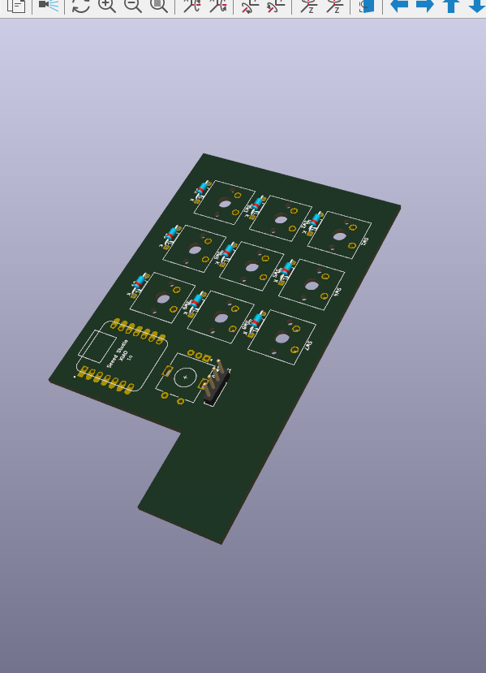
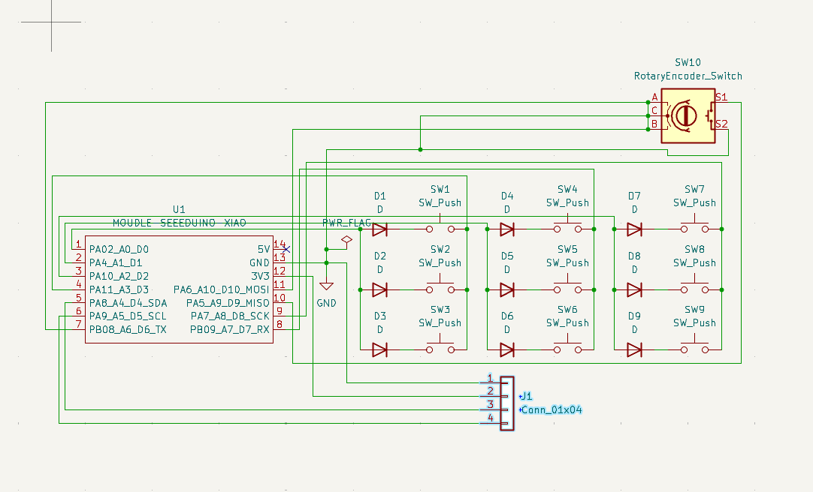

# The Maker Grid Macropad

The Maker Grid Macropad is a 9-key macropad with a rotary encoder and an OLED Display. It uses KMK firmware on a Seeed XIAO RP2040. 

It serves as a dedicated hardware tool to make designing custom robotics chassis, brackets, and mechanisms in CAD much more efficient!

## Features:
* 3D printed sandwich-style case. looks awesome doesn't it??
* 128x32 OLED Display to show active tool layers
* EC11 Rotary encoder for zooming and panning across the canvas
* 9 Keys for all my most-used CAD shortcuts

## CAD Model:

Everything fits together using M3 Bolts and heatset inserts. 
It has 2 separate 3D printed pieces. The bottom shell where the PCB sits, and the top plate with the cutouts for the switches. 

Made in Fusion360. Nifty

## PCB
Here's my PCB! It was made in KiCad. 

### Schematic

### PCB

I used a COL2ROW diode matrix for the keyswitch footprints to prevent ghosting. I think in retrospect, routing the I2C traces for the OLED was the trickiest part. 

## Firmware Overview
This hackpad uses KMK firmware (CircuitPython) for everything.

* The rotary encoder zooms in and out on the canvas. 
* The 9 keys currently act as macros for my most used Fusion 360 tools, dynamically changing based on whether I am Sketching, Solid Modeling, or Assembling.
* The OLED displays exactly which layer I am currently on!

I might add more in the future! That's it for now

## BOM:
Here should be everything you need to make this hackpad

* 9x Cherry MX-style Switches
* 9x Blank DSA Keycaps
* M3 Heat-Set Inserts & M3 Socket Cap Screws
* 9x 1N4148 Through-hole Diodes
* 1x 0.91" 128x32 OLED Display
* 1x EC11 Rotary Encoder + Knob
* 1x XIAO RP2040
* 1x Case (2 3D printed parts)

## Extra stuff
Oh fun fact: I designed this specifically because clicking through menus while designing our base robot for FTC Team 7082 was taking way too long LOL