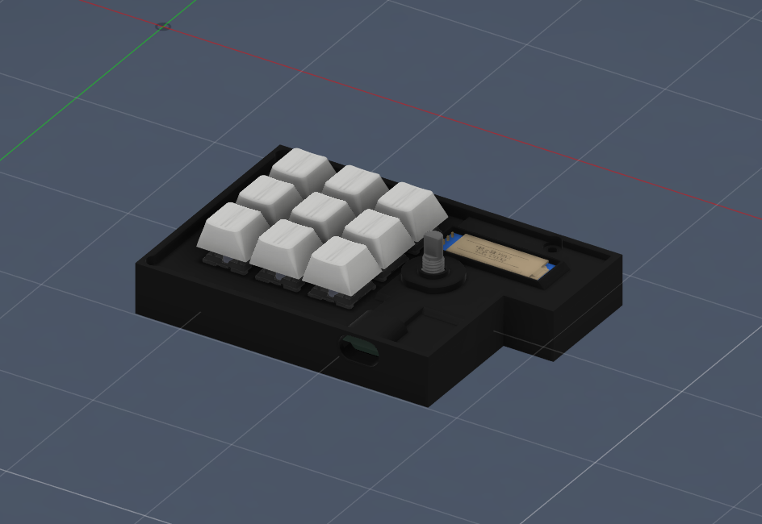
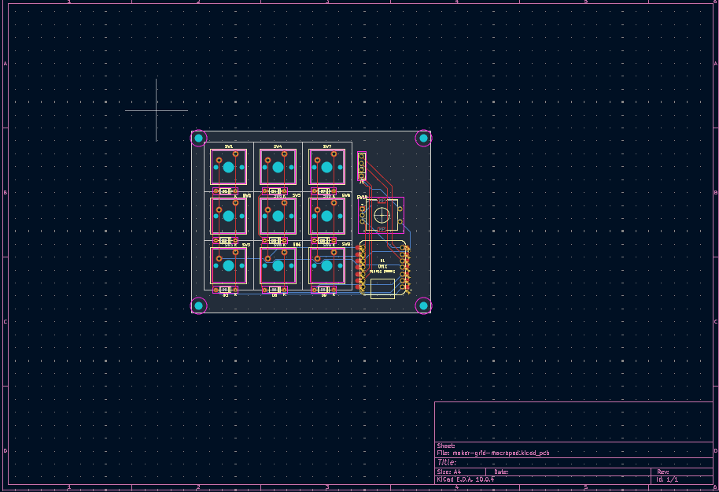

# The Maker Grid Macropad

A custom 9-key mechanical macropad featuring a rotary encoder and an OLED display, designed to optimize workflows in Autodesk Fusion 360 and mechanical engineering software.

## Project in Action

## Open Source Hardware Design

### Schematic Capture

### Two-Layer PCB Layout

## Features
* **3x3 Matrix Grid:** 9 tactile MX mechanical switches mapped to primary CAD commands.
* **Rotary Encoder Integration:** EC11 knob programmed for smooth canvas zooming, scrolling, and timeline scrub navigation.
* **0.91" I2C OLED Display:** Real-time visual feedback using an SSD1306 screen to show active tool layers.
* **Seeed Studio XIAO RP2040 Core:** High-performance, compact dual-core ARM Cortex-M0+ processing node running CircuitPython/KMK.

## How It Works
The hardware design focuses on tight component tolerances, utilizing physical clearances tailored for custom integration. The electronic layer routing isolates the I2C bus signals for the OLED display and maps the key matrix using a efficient `COL2ROW` diode orientation to eliminate key ghosting.

The firmware leverages the lightweight KMK framework running on a CircuitPython stack. It reads digital signals from the switch matrix and translates them into physical USB HID keyboard events instantly without requiring local host drivers.

## Repository Structure
* `/CAD`: Contains clean `.step` models of the Top and Bottom enclosure assemblies ready for 3D printing slicing.
* `/PCB`: Contains the native, editable KiCad schematic (`.kicad_sch`) and board layout (`.kicad_pcb`) design files.
* `/production`: Holds the production-ready fabrication file package (`gerbers.zip`).
* `/Firmware`: Houses the localized Python script configuration (`main.py`) deployed to the RP2040 microcontroller.

## Bill of Materials (BOM)
* 1x Seeed Studio XIAO RP2040 Microcontroller
* 9x MX-style Mechanical Switches
* 9x Blank DSA Profile Keycaps
* 9x 1N4148 Through-hole Switching Diodes
* 1x 0.91" I2C OLED Display Module (SSD1306)
* 1x EC11 Rotary Encoder + Custom Knob Profile
* M3 Heat-Set Inserts & M3 Socket Cap Screws